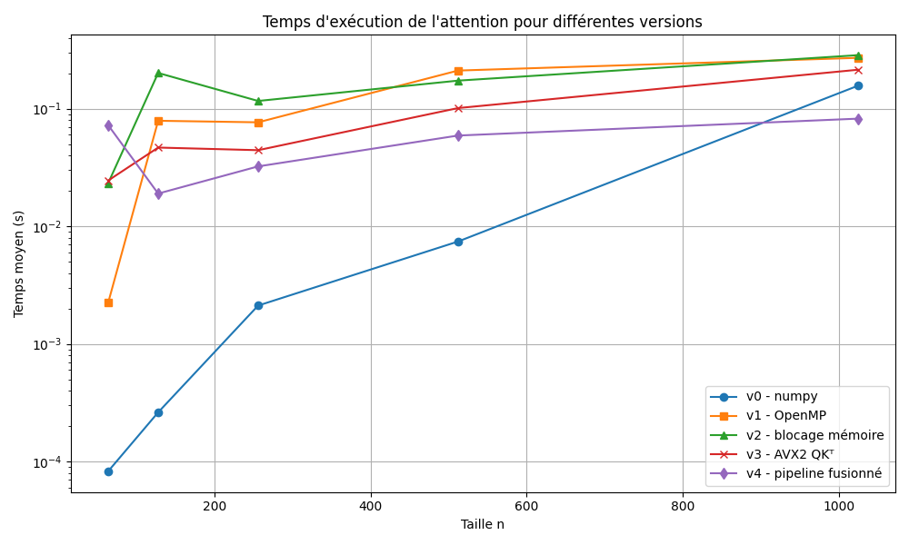
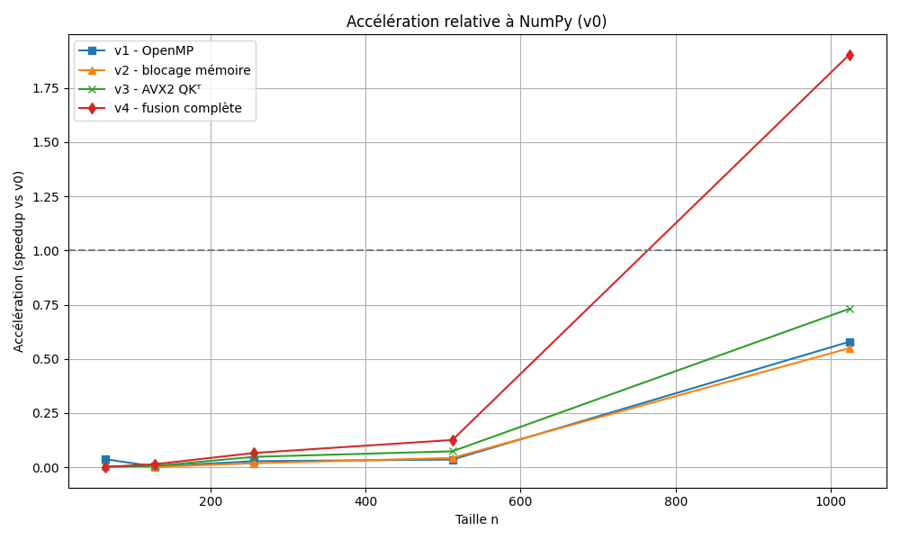

# 🚀 Optimisation parallèle du mécanisme d'attention

Ce projet a été réalisé dans le cadre du cours de Programmation en parallèle. Il consiste à optimiser l'opération d'attention classique utilisée dans les architectures Transformer :

$$
\text{Attention}(Q, K, V) = \text{softmax}\left( \frac{Q K^\top}{\sqrt{d_k}} \right) V
$$

Notre objectif a été de concevoir, implémenter et comparer plusieurs stratégies de parallélisation pour cette opération, tout en minimisant le nombre d’expérimentations grâce à une démarche guidée par le benchmark.

---

## 🧠 Objectifs

* Implémenter plusieurs versions de l'attention avec différents niveaux d’optimisation (OpenMP, AVX2, blocage mémoire, pipeline fusionné).
* Mettre en place un benchmark fiable, centralisé et statistiquement stable.
* Comparer les performances (temps et accélération) de chaque version.
* Identifier la meilleure stratégie de parallélisation à travers des tests intelligents, et non une grille exhaustive.

---

## 📂 Structure du projet

```
Parallel-Programming/
│
├── benchmarks/                # Données de benchmark CSV
│   └── benchmark_all.csv
│
├── figures/                   # Graphiques de performance
│   ├── benchmark_temps.png
│   └── benchmark_speedup.png
│
├── archives/                  # Anciennes versions de l’implémentation
│
├── attention_numpy.py         # Version NumPy (v0) de l'attention
├── attention_impl.cpp         # Implémentation C++ des versions v1 à v4
├── attention_impl.h           # Interface des fonctions C++ pour Cython
├── attention.pyx              # Wrapper Cython
│
├── setup.py                   # Script de compilation Cython/C++
├── benchmark_attention.py     # Script de benchmark principal
├── plot_benchmark.py          # Génération des graphiques
├── test_attention.py          # Tests unitaires de validation
└── README.md                  # Ce fichier
```

---

## ⚙️ Installation

1. Assurez-vous d’avoir un environnement Python ≥ 3.10 avec `numpy`, `cython`, `matplotlib` et `pandas`.
2. Compilez l’extension Cython/C++ :

```bash
python setup.py build_ext --inplace
```

---

## 🚦 Lancer les benchmarks

Le script suivant exécute toutes les versions (v0 à v4) sur des tailles croissantes :

```bash
python benchmark_attention.py
```

Les résultats seront sauvegardés dans `benchmarks/benchmark_all.csv`.

---

## 📈 Générer les graphiques

Pour créer les figures à partir des résultats du benchmark :

```bash
python plot_benchmark.py
```

Les fichiers suivants seront créés :

* `figures/benchmark_temps.png`
* `figures/benchmark_speedup.png`

---

## ✅ Versions implémentées

| Version | Description                                 |
| ------- | ------------------------------------------- |
| `v0`    | Référence en NumPy                          |
| `v1`    | C++ + OpenMP (multithread)                  |
| `v2`    | Blocage mémoire (cache blocking)            |
| `v3`    | Vectorisation AVX2/FMA sur QK᷐              |
| `v4`    | Pipeline fusionné AVX2 : QK᷐ + softmax + PV |

---

## 🔍 Résultats

* La version v4 devient la plus rapide à partir de `n = 512`.
* À `n = 1024`, elle dépasse un facteur de speedup de **×1.9** par rapport à NumPy.
* L’approche par pipeline fusionné AVX2 est celle qui présente le meilleur rapport complexité/performance.

Les résultats complets sont présentés dans les deux graphiques ci-dessous.

<p align="center">
  
  <br>
  <em>Figure : Temps d'exécution moyen par version</em>
</p>

<p align="center">
  
  <br>
  <em>Figure : Accélération (speedup) relative à NumPy</em>
</p>

---

## 📚 Licence

Projet académique réalisé dans le cadre d’un TP du cours *Programmation en parallèle*. Aucune redistribution commerciale autorisée.

---

## ✍️ Auteurs

* Étudiant : \[Ismael DEMBELE]
* Encadrant : \[Xavier DUPRE]